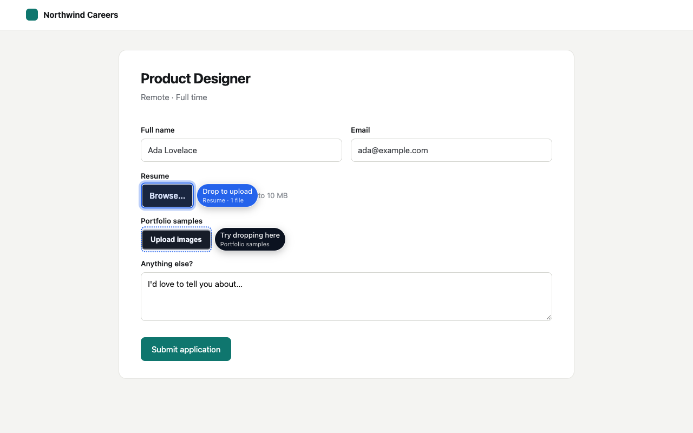

<p align="center">
  
</p>

<h1 align="center">DnD Anywhere</h1>

<p align="center">
  Drag and drop files onto <b>any</b> upload button, on any website.<br>
  Free, open source, no data collection, zero network requests.
</p>

<p align="center">
  <a href="https://github.com/rjach/dnd-anywhere/actions/workflows/ci.yml"></a>
  <a href="https://github.com/rjach/dnd-anywhere/actions/workflows/e2e.yml"></a>
  <a href="https://securityscorecards.dev/viewer/?uri=github.com/rjach/dnd-anywhere"></a>
  <a href="LICENSE"></a>
</p>

<p align="center">
  <a href="https://rjach.github.io/dnd-anywhere/">Website</a> ·
  <a href="https://rjach.github.io/dnd-anywhere/privacy/">Privacy</a> ·
  <a href="https://rjach.github.io/dnd-anywhere/support/">Support</a> ·
  <a href="CONTRIBUTING.md">Contributing</a>
</p>



Lots of sites only offer a "Browse…" button for uploads. DnD Anywhere turns every file field and upload button into a drop zone while you drag files into the window, and hands the files to the page exactly as if you had picked them in the file dialog.

## Install

| Browser                   | Status                        |
| ------------------------- | ----------------------------- |
| Chrome, Brave, Arc, Opera | Chrome Web Store: coming soon |
| Microsoft Edge            | Edge Add-ons: coming soon     |
| Firefox 128+              | Firefox Add-ons: coming soon  |

Until the store listings are live, [install from source](#install-from-source).

## How it works

- **Idle until you drag.** Nothing scans the page until files are dragged into the window. Then it finds upload fields: visible inputs, hidden inputs behind labels and styled buttons, inputs inside shadow DOM (open and closed) and iframes.
- **Upload buttons too.** Many widgets create a file input only when you click their button. DnD Anywhere clicks the button for you and, instead of opening a dialog, hands over the files you dropped.
- **Framework-safe.** Files arrive with the same `input` and `change` events a real file pick fires, so React, Vue and other app state updates normally.
- **Polite.** On sites that already support drag and drop, it stays out of the way (hold <kbd>Alt</kbd> to override). It respects `accept` and `multiple`.

Details: [docs/architecture.md](docs/architecture.md).

## Privacy

- **Zero network requests.** CI fails any build that contains `fetch`, `XMLHttpRequest`, `WebSocket`, `sendBeacon` or `EventSource` ([scripts/check-no-network.mjs](scripts/check-no-network.mjs)).
- **No data collection.** No analytics, telemetry or crash reports.
- **One permission:** `storage`, for your settings. The content script runs on all sites because upload fields can be anywhere; it is idle until you drag files.
- **Readable builds.** The shipped code isn't minified, and every release zip has a [build provenance attestation](docs/release-process.md#verifying-a-release).

Read the full [privacy policy](https://rjach.github.io/dnd-anywhere/privacy/) and the [security model](docs/security-model.md).

## Install from source

Requirements: Node.js 22.12+ and pnpm (via [Corepack](https://nodejs.org/api/corepack.html): `corepack enable`).

```sh
git clone https://github.com/rjach/dnd-anywhere.git
cd dnd-anywhere
pnpm install
pnpm build
```

Then load it:

- **Chrome / Edge:** open `chrome://extensions`, turn on **Developer mode**, choose **Load unpacked**, and select `extension/.output/chrome-mv3`.
- **Firefox:** open `about:debugging#/runtime/this-firefox`, choose **Load Temporary Add-on**, and select any file in `extension/.output/firefox-mv3`.

For development with live reload, run `pnpm dev` (see [CONTRIBUTING.md](CONTRIBUTING.md)).

## Known limitations

- Browsers don't allow extensions on their own pages (`chrome://`, extension stores, the PDF viewer).
- Some sites only accept files from a _real_ click or file dialog (they check `event.isTrusted`). When a drop doesn't take, DnD Anywhere offers to open the normal picker.
- Upload buttons are recognized by their wording, in about 15 languages. Unusual wording may be missed; [site adapters](docs/adding-a-site-adapter.md) fix specific sites.
- Sites that use the File System Access API (`showOpenFilePicker`) aren't supported yet.
- Folder drops aren't supported yet.
- Drop zones in an iframe appear when the pointer enters that iframe.

## Project layout

```
extension/   the browser extension (WXT, TypeScript, Preact for pages)
site/        landing page, privacy policy and terms (Astro → GitHub Pages)
store/       store listing text, screenshots and promo art
docs/        architecture, security model, guides and decision records
scripts/     CI guards: no network, manifest snapshot, bundle size, licenses
```

## Contributing

Contributions are welcome, especially reports and [adapters](docs/adding-a-site-adapter.md) for sites that don't work yet. Read [CONTRIBUTING.md](CONTRIBUTING.md) and the [Code of Conduct](CODE_OF_CONDUCT.md). For security issues, see [SECURITY.md](SECURITY.md).

## License

[MIT](LICENSE) © Rojan Acharya and contributors. Third-party licenses: [THIRD_PARTY_NOTICES.md](THIRD_PARTY_NOTICES.md).

Not affiliated with Google, Microsoft or Mozilla.
